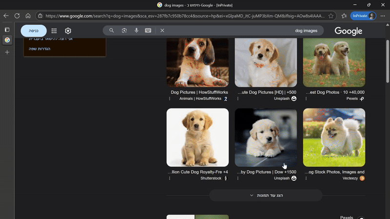

# MCP Windows Screenshots

[](https://www.npmjs.com/package/mcp-windows-screenshots)
[](https://opensource.org/licenses/MIT)

An MCP (Model Context Protocol) server that enables Claude to access Windows screenshots from WSL2. Perfect for seamlessly sharing screenshots with Claude Code without manual file navigation.

<p align="center">
  
</p>

## Why This Tool?

When using Claude Code in WSL2, sharing Windows screenshots requires navigating complex file paths like `/mnt/c/Users/...`. This tool simplifies the process to just:
1. Take a screenshot on Windows (Win+Shift+S)
2. Ask Claude to show your latest screenshot
3. Claude instantly accesses and displays it

No more copy-pasting paths or navigating directories!

## Prerequisites

- Windows 10/11 with WSL2
- Node.js 18+ in WSL2
- Claude Code CLI installed

## Installation

Simply run this command in your WSL2 terminal:

```bash
claude mcp add windows-screenshots -s user \
  -e "WINDOWS_USERNAME=YourWindowsUsername" \
  -e "MCP_SCREENSHOT_DIRS=/mnt/c/Users/YourWindowsUsername/Pictures/Screenshots" \
  -- npx mcp-windows-screenshots@latest
```

Replace `YourWindowsUsername` with your actual Windows username.

### Example

For a user named "john" with screenshots in OneDrive:

```bash
claude mcp add windows-screenshots -s user \
  -e "WINDOWS_USERNAME=john" \
  -e "MCP_SCREENSHOT_DIRS=/mnt/c/Users/john/OneDrive/Pictures/Screenshots" \
  -- npx mcp-windows-screenshots@latest
```

That's it! Restart Claude Code and you're ready to go.

## Usage

Once installed, Claude can use these tools:

### Have Claude look view a Screenshot
Ask Claude: "Look at the latest screenshot"

Claude will automatically find it and look at the image.

### List Recent Screenshots
Ask Claude: "Show me my latest screenshots"

Claude will use `mcp__windows-screenshots__list_screenshots` to display your recent screenshots with timestamps and sizes.


### Check Screenshot Directories
Ask Claude: "Which directories are you checking for screenshots?"

Claude will use `mcp__windows-screenshots__list_directories` to show all configured paths.

## Configuration

### Environment Variables

- `WINDOWS_USERNAME`: Your Windows username (defaults to WSL username)
- `MCP_SCREENSHOT_DIRS`: Custom screenshot directory. For multiple directories, separate with semicolons: `/path/1;/path/2`

### Default Search Locations

The tool automatically searches these common locations:
- `/mnt/c/Users/[username]/Pictures/Screenshots`
- `/mnt/c/Users/[username]/Pictures`
- `/mnt/c/Users/[username]/OneDrive/Pictures/Screenshots`
- `/mnt/c/Users/[username]/OneDrive/Pictures 2/Screenshots 1`
- `/mnt/c/Users/[username]/Documents/Screenshots`
- `/mnt/c/Users/[username]/Desktop`
- `/mnt/c/Users/[username]/AppData/Local/Temp`

## Troubleshooting

### No screenshots found
1. Verify your Windows username is correct
2. Ask Claude to "list screenshot directories" to see which paths are being searched
3. Ensure your screenshots are saved in one of the searched directories
4. Set a custom directory with `MCP_SCREENSHOT_DIRS` if needed

### Tool not available
1. Restart Claude Code after installation
2. Run `claude mcp list` to verify the server is installed
3. Ensure you used `-s user` when adding the server

### Environment variables not working
Make sure you're using the `claude mcp add` command with `-e` flags as shown in the installation section.

## Development

To contribute or modify this tool:

```bash
git clone https://github.com/rubinsh/mcp-windows-screenshots.git
cd mcp-windows-screenshots
npm install
npm run build
```

## License

MIT © [rubinsh](https://github.com/rubinsh)
